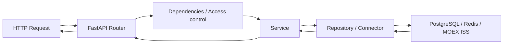

# MoexMonitorEasy

`MoexMonitorEasy` - это backend-сервис на `FastAPI`, который:

- получает акции с Московской биржи через публичный `MOEX ISS`;
- сохраняет их в `PostgreSQL`;
- использует `Redis` для auth-сессий;
- защищает API через `JWT access/refresh tokens`;
- управляет доступом через роли и permissions;
- поддерживает миграции через `Alembic`;
- форматируется через `black`.

Проект построен вокруг идеи "сначала получить и сохранить реестр акций MOEX, затем уже работать с ним из своей базы данных и сервисов".

---

## Содержание

- [1. Назначение проекта](#1-назначение-проекта)
- [2. Технологический стек](#2-технологический-стек)
- [3. Архитектура проекта](#3-архитектура-проекта)
- [4. Структура каталогов](#4-структура-каталогов)
- [5. Жизненный цикл приложения](#5-жизненный-цикл-приложения)
- [6. Конфигурация и переменные окружения](#6-конфигурация-и-переменные-окружения)
- [7. Docker и запуск проекта](#7-docker-и-запуск-проекта)
- [8. Работа с БД и миграциями](#8-работа-с-бд-и-миграциями)
- [9. Форматирование кода через black](#9-форматирование-кода-через-black)
- [10. Система аутентификации и авторизации](#10-система-аутентификации-и-авторизации)
- [11. MOEX модуль](#11-moex-модуль)
- [12. API эндпоинты](#12-api-эндпоинты)
- [13. Практические сценарии работы](#13-практические-сценарии-работы)
- [14. Подробное описание модулей](#14-подробное-описание-модулей)
- [15. Что важно знать перед дальнейшей разработкой](#15-что-важно-знать-перед-дальнейшей-разработкой)

---

## 1. Назначение проекта

Проект решает несколько задач:

1. Получить список всех акций с MOEX.
2. При необходимости догрузить расширенную информацию по каждой акции.
3. Сохранить всё в собственную БД.
4. Дать защищённый API для дальнейшей плотной работы с этими данными.
5. Централизованно управлять доступом к API через роли и permissions.

Важный архитектурный принцип проекта:

- внешние интеграции изолированы в коннекторах;
- бизнес-логика живёт в сервисах;
- HTTP-слой сосредоточен в роутерах;
- работа с БД идёт через репозитории и `DBManager`;
- схема БД меняется только миграциями `Alembic`.

---

## 2. Технологический стек

- `Python 3.12`
- `FastAPI`
- `SQLAlchemy 2.0` с `asyncpg`
- `PostgreSQL`
- `Redis`
- `PyJWT`
- `Alembic`
- `black`
- `Docker` / `docker compose`

---

## 3. Архитектура проекта

Высокоуровнево система состоит из следующих слоёв:

1. `connectors`
   Отвечают за работу с внешними системами.
   Примеры:
   - MOEX ISS
   - Redis

2. `moduls/*/service`
   Здесь находится бизнес-логика.
   Примеры:
   - регистрация/логин/refresh/logout;
   - синхронизация акций MOEX;
   - автосбор permissions из роутов.

3. `moduls/*/repository`
   Слой доступа к данным внутри БД.

4. `moduls/*/router`
   HTTP-API слой FastAPI.

5. `db` и `utils`
   Общая инфраструктура БД и dependency injection.

Схема движения запроса обычно такая:



---

## 4. Структура каталогов

```text
.
├── alembic/                    # миграции БД
├── src/
│   ├── connectors/             # интеграции с внешними системами
│   ├── core/                   # конфиг и базовая инфраструктура
│   ├── db/                     # engine, sessionmaker, DB dependencies
│   ├── moduls/
│   │   ├── auth/               # auth + access control
│   │   ├── base/               # базовые репозитории/сервисы
│   │   └── moex/               # работа с MOEX акциями
│   ├── utils/                  # DBManager и compatibility helpers
│   ├── init.py                 # инициализация Redis manager
│   └── main.py                 # точка входа приложения
├── alembic.ini
├── Dockerfile
├── docker-compose.yml
├── pyproject.toml
├── requirements.txt
└── README.md
```

---

## 5. Жизненный цикл приложения

При старте `FastAPI` происходит следующее:

1. Создаётся `DBManager`.
2. В транзакции вызывается `AccessService.sync_permissions_from_app(app)`.
3. Сервис проходит по всем зарегистрированным роутам FastAPI.
4. Для каждого роутера считывается access-метка из `openapi_extra`.
5. По этим меткам автоматически синхронизируются permissions в БД.
6. Создаются или дополняются базовые роли:
   - `root`
   - `user`
7. Пользователи нормализуются по ролям.
8. Подключается Redis.
9. Приложение начинает обслуживать запросы.

В Docker перед запуском приложения дополнительно выполняется:

```bash
alembic upgrade head
```

То есть порядок в контейнере такой:

1. Применить миграции.
2. Поднять FastAPI.
3. Во время startup синхронизировать permissions и роли.

---

## 6. Конфигурация и переменные окружения

Основные настройки лежат в `src/core/config.py`.

Теперь проект настроен по принципу:

1. в репозитории лежит шаблон `.env.example`;
2. перед запуском ты создаёшь собственный `.env`;
3. и приложение, и `docker compose` читают значения из `.env`.

Базовый workflow такой:

```bash
copy .env.example .env
```

После этого нужно открыть `.env` и заполнить значения под своё окружение.

Используются переменные:

- `BACKEND_PORT`
- `POSTGRES_HOST_PORT`
- `REDIS_HOST_PORT`
- `DB_HOST`
- `DB_PORT`
- `DB_USER`
- `DB_PASS`
- `DB_NAME`
- `REDIS_HOST`
- `REDIS_PORT`
- `AUTH_JWT_SECRET`
- `AUTH_JWT_ALGORITHM`
- `AUTH_ACCESS_TOKEN_MINUTES`
- `AUTH_REFRESH_TOKEN_DAYS`

Пример `.env`:

```env
BACKEND_PORT=8000
POSTGRES_HOST_PORT=15432
REDIS_HOST_PORT=16379

DB_HOST=postgres
DB_PORT=5432
DB_USER=moex_user
DB_PASS=moex_password
DB_NAME=moex_db

REDIS_HOST=redis
REDIS_PORT=6379

AUTH_JWT_SECRET=change-me-please
AUTH_JWT_ALGORITHM=HS256
AUTH_ACCESS_TOKEN_MINUTES=15
AUTH_REFRESH_TOKEN_DAYS=7
```

Важно:

- `BACKEND_PORT` - внешний порт backend на хост-машине;
- `POSTGRES_HOST_PORT` - внешний порт Postgres на хост-машине;
- `REDIS_HOST_PORT` - внешний порт Redis на хост-машине;
- `DB_HOST`, `DB_PORT`, `DB_USER`, `DB_PASS`, `DB_NAME` - настройки подключения backend к Postgres;
- `REDIS_HOST`, `REDIS_PORT` - настройки подключения backend к Redis;
- `AUTH_*` - JWT-настройки.

### Шаблон `.env.example`

В проект добавлен шаблон:

- `.env.example`

Он нужен как стартовая точка для нового окружения.

Рекомендуемый порядок:

1. Скопировать `.env.example` в `.env`
2. Изменить секреты и порты при необходимости
3. Запустить проект

### Как `.env` используется в Docker

`docker-compose.yml` теперь не содержит жёстко вшитых значений для базы, Redis и JWT.

Он подставляет значения из `.env`:

- backend получает `DB_*`, `REDIS_*`, `AUTH_*`;
- postgres получает `DB_USER`, `DB_PASS`, `DB_NAME`;
- проброс портов тоже управляется через `.env`.

Это означает, что ты можешь поменять:

- логин/пароль БД;
- имя БД;
- секрет JWT;
- внешние порты сервисов;

без правок `docker-compose.yml`.

---

## 7. Docker и запуск проекта

### Запуск всего стека

```bash
copy .env.example .env
docker compose up -d --build
```

Если `.env` уже создан, первая команда не нужна.

Что поднимется:

- `backend`
- `postgres`
- `redis`

### Проверка состояния

```bash
docker compose ps
docker compose logs -f backend
```

### Остановка

```bash
docker compose down
```

### Что делает backend-контейнер

В `Dockerfile` задан такой сценарий запуска:

```bash
alembic upgrade head && uvicorn src.main:app --host 0.0.0.0 --port 8000
```

Это значит:

- если схема БД отстаёт, миграции будут применены;
- только после этого стартует приложение.

### Полезные URL

- Swagger UI: `http://localhost:${BACKEND_PORT}/api/v1/docs`
- OpenAPI schema: `http://localhost:${BACKEND_PORT}/api/v1/openapi.json`

При значениях из шаблона это будет:

- `http://localhost:8000/api/v1/docs`
- `http://localhost:8000/api/v1/openapi.json`

---

## 8. Работа с БД и миграциями

### Почему здесь Alembic

Раньше схема БД могла создаваться через `create_all()`, но это плохо подходит для реального проекта:

- нет истории изменений;
- невозможно безопасно обновлять схему между версиями;
- сложно контролировать прод-окружения.

Теперь проект использует только `Alembic`.

### Как устроены миграции

- конфиг: `alembic.ini`
- runtime-настройка: `alembic/env.py`
- ревизии: `alembic/versions/`

В `env.py` Alembic:

- берёт `DATABASE_URL` из `src.core.config.settings`;
- загружает все SQLAlchemy-модели через `load_db_models()`;
- использует `Base.metadata` для сравнения схемы.

### Базовая миграция

В проекте есть baseline-миграция:

- `alembic/versions/20260412_170000_baseline_schema.py`

Она описывает текущую схему:

- `auth_users`
- `auth_roles`
- `auth_permissions`
- `auth_user_roles`
- `auth_role_permissions`
- `moex_shares`

### Команды Alembic

Создать новую миграцию:

```bash
.\.venv\Scripts\alembic.exe revision --autogenerate -m "add some field"
```

Применить миграции:

```bash
.\.venv\Scripts\alembic.exe upgrade head
```

Посмотреть текущую ревизию:

```bash
.\.venv\Scripts\alembic.exe current
```

Проверить, есть ли несгенерированные изменения:

```bash
.\.venv\Scripts\alembic.exe check
```

### Рекомендуемый workflow изменения схемы

1. Изменить SQLAlchemy-модель.
2. Выполнить `revision --autogenerate`.
3. Проверить содержимое миграции руками.
4. Выполнить `upgrade head`.
5. Прогнать приложение и тестовые сценарии.

---

## 9. Форматирование кода через black

Проект использует `black`.

Конфиг лежит в `pyproject.toml`:

- `line-length = 100`
- `target-version = py312`

Запуск форматирования:

```bash
.\.venv\Scripts\black.exe src alembic
```

Идея простая:

- один formatter;
- минимум споров о стиле;
- предсказуемый дифф.

---

## 10. Система аутентификации и авторизации

В проекте разделены:

- аутентификация: кто пользователь;
- авторизация: что пользователю разрешено.

### 10.1. Аутентификация

Используется связка:

- `access token` - короткоживущий JWT;
- `refresh token` - долгоживущий JWT;
- Redis - хранилище активных refresh-сессий и blacklist access-токенов.

#### Что хранится в access token

- `sub` - ID пользователя
- `username`
- `role`
- `type=access`
- `jti`
- `iat`
- `exp`

#### Что хранится в refresh token

То же самое, но:

- `type=refresh`
- другой срок жизни

### 10.2. Где используются токены

`access token`:

- для вызова защищённых API;
- для `/auth/me`;
- для `/auth/logout`;
- для бизнес-эндпоинтов вроде MOEX.

`refresh token`:

- только для `/auth/refresh`.

### 10.3. Почему refresh не public

`refresh` не считается публичным endpoint, потому что:

- он требует валидный refresh token;
- refresh token уже представляет существующую сессию;
- это не анонимный вход в систему, а операция продления текущей сессии.

В проекте это оформлено отдельным типом доступа:

- `PUBLIC`
- `ACCESS`
- `REFRESH`

### 10.4. Роли

Сейчас базовые роли две:

- `root`
- `user`

`root`:

- получает все защищённые permissions, которые зарегистрированы в приложении.

`user`:

- получает только:
  - `auth.refresh`
  - `auth.logout`
  - `auth.me`

То есть обычный пользователь не может читать MOEX-данные по API, если ему явно не будет выдана дополнительная роль или permission.

### 10.5. Permissions

Permissions хранятся строками, например:

- `auth.refresh`
- `auth.logout`
- `auth.me`
- `moex.shares.read`
- `moex.shares.sync`
- `moex.shares.stored.read`

Они:

- автоматически собираются из роутов на старте приложения;
- создаются/обновляются в БД;
- затем распределяются по ролям.

### 10.6. Как проверяется доступ

При входящем запросе цепочка может быть одной из трёх:

#### Вариант 1. Public endpoint

Примеры:

- `/auth/register`
- `/auth/login`
- `/api/v1/docs`
- `/api/v1/openapi.json`

Проверка токена не нужна.

#### Вариант 2. Access-bound endpoint

Примеры:

- `/auth/me`
- `/auth/logout`
- `/moex/shares`
- `/moex/shares/sync`
- `/moex/shares/stored`

Сначала:

- проверяется Bearer header;
- декодируется access token;
- проверяется blacklist;
- загружается пользователь;
- проверяется его активность;
- затем проверяется permission.

#### Вариант 3. Refresh-bound endpoint

Пример:

- `/auth/refresh`

Сначала:

- из JSON-body извлекается `refresh_token`;
- токен валидируется;
- проверяется наличие сессии в Redis;
- загружается пользователь;
- проверяется permission `auth.refresh`.

### 10.7. Ошибки доступа

Проект специально использует явные ошибки, а не дефолтные framework-тексты.

Примеры:

- `Authorization bearer token is required`
- `Authorization header must use Bearer scheme`
- `Authorization bearer token is empty`
- `Refresh token is required`
- `Permission 'moex.shares.read' is required`

Это сделано для предсказуемого поведения API и удобной отладки.

---

## 11. MOEX модуль

MOEX-модуль отвечает за:

- получение акций с `iss.moex.com`;
- получение details по отдельной акции;
- синхронизацию данных в БД;
- чтение уже сохранённого локального реестра.

### 11.1. Откуда берутся акции

Базовый список:

```text
/iss/engines/stock/markets/shares/securities.json
```

Расширенная информация по бумаге:

```text
/iss/securities/{SECID}.json
/iss/engines/stock/markets/shares/securities/{SECID}.json
```

### 11.2. Что сохраняется в БД

Одна запись в таблице `moex_shares` содержит:

- `secid`
- короткие нормализованные поля (`shortname`, `isin`, `boardid`, и т.д.)
- `security_payload` - исходный базовый payload MOEX
- `details_payload` - расширенный payload
- `details_error` - текст ошибки, если details не загрузились

### 11.3. Как синхронизация работает логически

Когда вызывается sync:

1. Из MOEX получается список акций.
2. Если `with_details=true`, параллельно тянутся details по каждой бумаге.
3. Данные приводятся к storage-формату.
4. Если MOEX вернул дубликаты по одному `SECID`, они дедуплицируются.
5. Все текущие акции в БД сначала помечаются `is_active=false`.
6. Далее выполняется bulk upsert.
7. Всё, что пришло в текущей синхронизации, становится `is_active=true`.

### 11.4. Почему есть дедупликация

MOEX может вернуть несколько строк на один и тот же `SECID`.

Сервис выбирает "лучшую" строку:

- предпочитает primary board;
- если primary board не помогает, предпочитает строку с `details_payload`.

Идея такая:

- в БД хранится единый реестр инструментов по `SECID`, а не все board-варианты как отдельные строки.

### 11.5. Сетевое поведение MOEX-коннектора

Коннектор настроен осторожно:

- `timeout = 5s`
- `max_retries = 2`
- `retry_backoff_seconds = 0.5`
- есть общий timeout budget на запрос
- есть fallback на `http://`, если ловится характерный SSL EOF от MOEX

Это сделано потому, что публичный ISS иногда ведёт себя нестабильно по SSL.

### 11.6. Ограничение времени на уровне API

Поверх коннектора роуты MOEX дополнительно ограничены через `asyncio.wait_for`.

То есть:

- даже если внутри будут retries,
- HTTP endpoint всё равно вернёт либо результат вовремя,
- либо `504`.

---

## 12. API эндпоинты

Базовый префикс API:

```text
/api/v1
```

### Документация

- `GET /api/v1/docs` - Swagger UI, public
- `GET /api/v1/openapi.json` - OpenAPI schema, public

### Auth

- `POST /api/v1/auth/register` - public
- `POST /api/v1/auth/login` - public
- `POST /api/v1/auth/refresh` - refresh-bound + `auth.refresh`
- `POST /api/v1/auth/logout` - access-bound + `auth.logout`
- `GET /api/v1/auth/me` - access-bound + `auth.me`

### MOEX

- `GET /api/v1/moex/shares` - `moex.shares.read`
- `POST /api/v1/moex/shares/sync` - `moex.shares.sync`
- `GET /api/v1/moex/shares/stored` - `moex.shares.stored.read`

---

## 13. Практические сценарии работы

### 13.1. Регистрация пользователя

```bash
curl -X POST http://localhost:8000/api/v1/auth/register \
  -H "Content-Type: application/json" \
  -d "{\"username\":\"rootuser\",\"password\":\"StrongPass123\"}"
```

Логика:

- если это первый пользователь в системе, он станет `root`;
- если не первый, он станет `user`.

### 13.2. Логин

```bash
curl -X POST http://localhost:8000/api/v1/auth/login \
  -H "Content-Type: application/json" \
  -d "{\"username\":\"rootuser\",\"password\":\"StrongPass123\"}"
```

Ответ:

```json
{
  "access_token": "...",
  "refresh_token": "...",
  "token_type": "bearer"
}
```

### 13.3. Получение текущего пользователя

```bash
curl http://localhost:8000/api/v1/auth/me \
  -H "Authorization: Bearer <access_token>"
```

### 13.4. Обновление токенов

```bash
curl -X POST http://localhost:8000/api/v1/auth/refresh \
  -H "Content-Type: application/json" \
  -d "{\"refresh_token\":\"<refresh_token>\"}"
```

### 13.5. Логаут

```bash
curl -X POST http://localhost:8000/api/v1/auth/logout \
  -H "Authorization: Bearer <access_token>" \
  -H "Content-Type: application/json" \
  -d "{\"refresh_token\":\"<refresh_token>\"}"
```

Что происходит:

- текущий access token добавляется в blacklist в Redis;
- если передан refresh token, он тоже удаляется из Redis.

### 13.6. Получить акции напрямую из MOEX

```bash
curl "http://localhost:8000/api/v1/moex/shares?with_details=false" \
  -H "Authorization: Bearer <root_access_token>"
```

С details:

```bash
curl "http://localhost:8000/api/v1/moex/shares?with_details=true&details_concurrency=5&request_timeout_seconds=40" \
  -H "Authorization: Bearer <root_access_token>"
```

### 13.7. Синхронизация акций в БД

```bash
curl -X POST "http://localhost:8000/api/v1/moex/shares/sync?with_details=false&request_timeout_seconds=40" \
  -H "Authorization: Bearer <root_access_token>"
```

### 13.8. Чтение сохранённых акций

```bash
curl "http://localhost:8000/api/v1/moex/shares/stored?limit=100&offset=0" \
  -H "Authorization: Bearer <root_access_token>"
```

### 13.9. Проверка прав обычного пользователя

Если вызвать MOEX endpoint пользователем с ролью `user`, то ожидаем:

```json
{
  "detail": "Permission 'moex.shares.read' is required"
}
```

---

## 14. Подробное описание модулей

Ниже - разбор каждого модуля и его роли в проекте.

### 14.1. `src/main.py`

Это точка входа приложения.

Что делает:

- создаёт `FastAPI`;
- подключает `auth_router` и `moex_router`;
- переопределяет пути docs/openapi;
- в `lifespan` синхронизирует permissions и подключает Redis.

Почему это важно:

- именно здесь проект становится "живым";
- именно здесь определяется состав подключённых роутеров;
- от этого состава потом зависит автогенерация permissions.

### 14.2. `src/init.py`

Инициализирует singleton-объект `redis_manager`.

Задача:

- дать приложению единое место доступа к Redis.

### 14.3. `src/core/config.py`

Централизованный конфиг на базе `pydantic-settings`.

Отвечает за:

- чтение переменных окружения;
- формирование `db_url`;
- формирование `redis_url`.

Это главный источник runtime-конфигурации приложения.

### 14.4. `src/core/logging.py`

Пользовательский wrapper над `loguru`.

Сейчас модуль есть в проекте как общая инфраструктура логирования, но в текущих бизнес-сценариях используется не активно.

Что умеет:

- форматировать логи;
- писать в stderr;
- писать в файлы;
- заворачивать функции в `log_exceptions`.

### 14.5. `src/db/database.py`

Главный модуль SQLAlchemy-инфраструктуры.

Что находится внутри:

- async engine;
- null-pool engine;
- session makers;
- `Base`;
- `load_db_models()`.

Почему `load_db_models()` важно:

- оно импортирует все модели до того, как `Alembic` или другие части системы работают с metadata;
- это гарантирует, что `Base.metadata` содержит полный набор таблиц.

### 14.6. `src/db/dependencies.py`

Главный модуль dependency injection для БД.

Содержит:

- `DBDep`
- `AtomicDBDep`
- `DBDepNullPool`
- `AtomicDBDepNullPool`
- pagination dependency

Идея:

- роуты получают уже готовый `DBManager`;
- сервисам и роутам не нужно вручную создавать сессии.

Пример:

```python
async def endpoint(db: DBDep):
    ...
```

### 14.7. `src/utils/db_manager.py`

Ключевой orchestration-объект для БД.

Он:

- открывает async session;
- подцепляет репозитории как атрибуты;
- управляет commit/rollback;
- даёт transaction-context manager.

Сейчас в него вшиты репозитории:

- `db.access`
- `db.auth_user`
- `db.moex_share`

Это делает код роутов и сервисов компактнее и единообразнее.

### 14.8. `src/utils/dependencies.py`

Compatibility wrapper.

Зачем он нужен:

- ранее зависимости жили в `src.utils.dependencies`;
- позже канонической точкой стал `src.db.dependencies`;
- этот модуль re-export'ит всё обратно, чтобы старые импорты не ломались.

### 14.9. `src/moduls/base/base.py`

Базовый generic repository.

Содержит общий CRUD:

- `get`
- `get_all`
- `get_by_filter`
- `create`
- `put`
- `patch`
- `delete_obj`

Это инфраструктурная база, от которой наследуются конкретные репозитории.

Важно:

- часть методов здесь довольно общая и не идеально подходит ко всем доменам;
- для важных бизнес-сценариев всё равно используются специализированные репозитории поверх базы.

### 14.10. `src/moduls/base/base_service.py`

Минимальная база для сервисов.

Хранит:

- `db: DBManager | None`

Нужна, чтобы сервисы единообразно принимали БД, но могли существовать и без неё, если работают только с внешним коннектором.

### 14.11. `src/connectors/redis_connector.py`

Низкоуровневый async wrapper над Redis.

Что умеет:

- `connect`
- `set`
- `get`
- `delete`
- `close`
- `clear`

Использование в проекте:

- refresh-сессии;
- blacklist access-токенов.

### 14.12. `src/connectors/moex_iss_connector.py`

Ключевой внешний коннектор проекта.

Отвечает за общение с MOEX ISS.

Функции:

- `get_all_shares()`
- `get_shares_page()`
- `get_security_details()`
- внутренний `_request_json()`

Особенности:

- короткий timeout;
- retries;
- backoff;
- общий timeout budget;
- fallback на HTTP при специфичных SSL EOF ошибках;
- извлечение табличных блоков MOEX (`columns + data -> list[dict]`).

Этот модуль изолирует всю нестабильность внешнего API от остального приложения.

### 14.13. `src/moduls/auth/auth_user.py`

SQLAlchemy-модель пользователя.

Поля:

- `id`
- `username`
- `password_hash`
- `role`
- `is_active`
- `created_at`
- `updated_at`

Поле `role` сейчас хранится как legacy/main role string.

Почему оно ещё есть:

- для совместимости;
- для нормализации старых пользователей;
- как простой публичный атрибут в `UserResponse`.

При этом реальная авторизация уже строится через связи `user -> roles -> permissions`.

### 14.14. `src/moduls/auth/auth_role.py`

Модель роли.

Примеры значений:

- `root`
- `user`

### 14.15. `src/moduls/auth/auth_permission.py`

Модель permission.

Примеры:

- `auth.me`
- `auth.refresh`
- `moex.shares.sync`

### 14.16. `src/moduls/auth/auth_user_role.py`

Таблица связи many-to-many между пользователями и ролями.

Позволяет:

- давать пользователю несколько ролей.

### 14.17. `src/moduls/auth/auth_role_permission.py`

Таблица связи many-to-many между ролями и permissions.

Позволяет:

- одной роли содержать много permissions;
- один permission использовать в нескольких ролях.

### 14.18. `src/moduls/auth/schemas.py`

Pydantic-схемы auth-модуля.

Используются как:

- request body;
- response model;
- контракт API.

### 14.19. `src/moduls/auth/auth_repository.py`

Репозиторий пользователей.

Добавляет к base-repository методы, которые нужны именно auth-логике:

- `get_by_username`
- `count_users`

### 14.20. `src/moduls/auth/access_repository.py`

Репозиторий access-control слоя.

Умеет:

- искать роли;
- искать permissions;
- создавать роли и permissions;
- назначать роль пользователю;
- назначать permission роли;
- заменять набор permissions у роли;
- вычислять роли пользователя;
- вычислять итоговые permissions пользователя.

Это сердце работы RBAC на уровне БД.

### 14.21. `src/moduls/auth/security.py`

Модуль криптографии и JWT.

Что делает:

- хэширует пароль через `scrypt`;
- проверяет пароль;
- создаёт access token;
- создаёт refresh token;
- декодирует JWT;
- считает TTL до истечения срока токена.

Почему это вынесено отдельно:

- service-слой не должен содержать криптографические детали;
- токен-логика централизована в одном месте.

### 14.22. `src/moduls/auth/auth_service.py`

Главный сервис аутентификации.

Отвечает за:

- регистрацию;
- логин;
- refresh;
- logout;
- получение пользователя по access token;
- получение пользователя по refresh token.

Важные детали:

- первый пользователь получает роль `root`;
- refresh-сессия живёт в Redis по ключу `auth:refresh:<jti>`;
- blacklist access-токенов живёт по ключу `auth:access:blacklist:<jti>`.

### 14.23. `src/moduls/auth/access_policy.py`

Модуль декларативной политики доступа для роутов.

Он задаёт формальный контракт:

- `PUBLIC`
- `ACCESS`
- `REFRESH`

И helper-функции:

- `public_access_meta()`
- `access_permission_meta()`
- `refresh_permission_meta()`

Зачем это нужно:

- роут явно помечает свой тип доступа;
- startup может автоматически собрать permissions;
- доступ становится централизованным и проверяемым.

### 14.24. `src/moduls/auth/access_service.py`

Сервис авторизации и синхронизации permission-каталога.

Функции:

- `sync_permissions_from_app(app)`
- `assign_role_to_user(...)`
- `get_access_context(user)`

Это один из самых важных модулей проекта.

Он:

- сканирует `FastAPI`-роуты;
- собирает permissions;
- создаёт базовые роли;
- назначает root все permissions;
- назначает user только базовые auth-permissions;
- нормализует пользователей.

### 14.25. `src/moduls/auth/access_dependencies.py`

Единая точка проверки доступа.

Тут находятся:

- извлечение Bearer token;
- извлечение refresh token из body;
- загрузка текущего пользователя;
- загрузка access-context;
- проверка permission;
- проверка refresh-permission.

Именно этот модуль обеспечивает правило "все проверки токенов и прав должны быть в одном месте".

### 14.26. `src/moduls/auth/dependencies.py`

Compatibility/re-export слой поверх `access_dependencies`.

Нужен:

- чтобы импортировать удобные alias'ы;
- чтобы не ломать старые места использования;
- чтобы дать helper `require_admin`.

### 14.27. `src/moduls/auth/auth_router.py`

HTTP слой auth-модуля.

Содержит endpoint'ы:

- register
- login
- refresh
- logout
- me

Здесь важно:

- роуты не реализуют auth-логику сами;
- они только принимают входные данные, dependencies и делегируют в `AuthService`.

### 14.28. `src/moduls/moex/moex_share.py`

SQLAlchemy-модель акции MOEX.

Это локальный реестр бумаг, с которым дальше и работает система.

Особенно важные поля:

- `secid` - главный бизнес-идентификатор;
- `security_payload` - базовый оригинальный payload;
- `details_payload` - расширенный payload;
- `details_error` - ошибка details;
- `is_active` - была ли бумага в последней синхронизации.

### 14.29. `src/moduls/moex/moex_repository.py`

Репозиторий для таблицы `moex_shares`.

Функции:

- `mark_all_inactive()`
- `upsert_many()`
- `list_active()`
- `count_active()`

Особенно важно `upsert_many()`:

- вставляет новые акции;
- обновляет существующие по `secid`;
- обновляет timestamp синхронизации;
- возвращает количество обработанных строк.

### 14.30. `src/moduls/moex/schemas.py`

Pydantic-схемы MOEX API.

Используются для:

- ответа "получить акции прямо из ISS";
- ответа "получить сохранённые акции";
- ответа sync-операции.

### 14.31. `src/moduls/moex/moex_service.py`

Главный сервис бизнес-логики MOEX.

Функции:

- `get_all_shares_with_info()`
- `sync_shares_to_db()`
- `get_stored_shares()`

Также содержит служебную логику:

- преобразование внешнего payload в storage row;
- приведение значений к bool;
- дедупликация по `SECID`.

### 14.32. `src/moduls/moex/moex_router.py`

HTTP слой MOEX-модуля.

Эндпоинты:

- получить акции с MOEX;
- синхронизировать акции в БД;
- прочитать сохранённые акции.

Содержит:

- query-параметры;
- permission checks;
- timeout на уровне API;
- перевод исключений коннектора в HTTP-ошибки.

### 14.33. `alembic/env.py`

Главный runtime-файл Alembic.

Он:

- подключает настройки БД;
- загружает SQLAlchemy metadata;
- запускает offline/online migrations.

### 14.34. `alembic/versions/*.py`

История изменений схемы БД.

В baseline-ревизии описана вся текущая структура проекта.

---

## 15. Что важно знать перед дальнейшей разработкой

### 15.1. Permissions теперь обязательны для непубличных роутов

Если добавить новый endpoint и не указать access-метку, startup должен падать.

Это специально:

- чтобы не было "случайно открытых" роутов;
- чтобы permissions не разъезжались с API.

### 15.2. Все изменения схемы БД делать только через Alembic

Не надо возвращать `create_all()`.

Правильный путь:

1. изменить модель;
2. создать миграцию;
3. применить миграцию.

### 15.3. Redis критичен для auth

Если Redis недоступен:

- refresh-сессии работать не будут;
- blacklist access-токенов работать не будет.

### 15.4. MOEX ISS - внешне нестабильный источник

Нужно помнить:

- ISS может отвечать медленно;
- могут быть SSL EOF проблемы;
- часть запросов может не успеть в жёсткие timeout'ы;
- поэтому бизнес-логика не должна предполагать, что внешний ISS всегда идеален.

### 15.5. Хранение акций сейчас построено как реестр по `SECID`

Это означает:

- одна строка в БД = один инструмент;
- не каждая торговая доска хранится как отдельная запись.

Если в будущем потребуется хранить каждую board-комбинацию отдельно, надо будет менять модель хранения.

### 15.6. User role сейчас очень ограничена

По текущим правилам:

- обычный пользователь может только:
  - refresh
  - logout
  - me

Это осознанное ограничение.

Если проекту понадобится более богатая модель прав, дальше логично добавлять:

- админские API для управления ролями;
- отдельные бизнес-роли;
- выдачу permissions без изменения кода.

---

## Краткий итог

Сейчас проект - это:

- API сервис на FastAPI;
- с хранением акций MOEX в PostgreSQL;
- с Redis-based auth session management;
- с RBAC на ролях и permissions;
- с автосинхронизацией permissions из роутов;
- с миграциями Alembic;
- с форматированием через black;
- с Docker-окружением для быстрого запуска.

Если дальше развивать проект, самые естественные направления такие:

1. Админские CRUD-эндпоинты для ролей и permissions.
2. Планировщик фоновой синхронизации MOEX.
3. Разделение read/write use-cases на отдельные сервисы.
4. Тесты на auth/access и MOEX sync.
